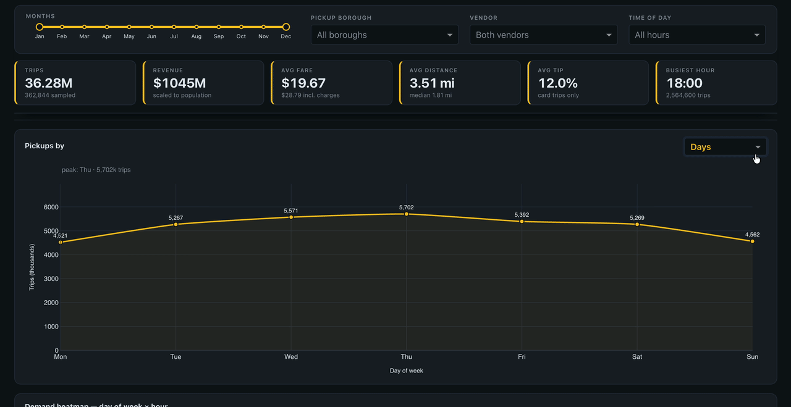

# NYC Yellow Taxi — Optimising Taxi Operations

Exploratory data analysis of **38 million+ New York City yellow taxi trips from 2023**, turned into an interactive Dash/Plotly dashboard that recommends where to position cabs, when to price up, and which zones drain supply.



*Switching the demand grain between days, hours and months, then narrowing the month range — every chart and KPI recomputes against the filter.*

## Table of Contents

- [Overview](#overview)
- [Aim](#aim)
- [Technologies](#technologies)
- [Data](#data)
- [Analysis and Visualization](#analysis-and-visualization)
- [Key Findings](#key-findings)
- [Challenges](#challenges)
- [Summary](#summary)
- [Project Organization](#project-organization)

## Overview

In this project I analyse the 2023 NYC Yellow Taxi trip records published by the **NYC Taxi & Limousine Commission (TLC)** to uncover operational, pricing and customer-experience insights for a new taxi operator entering the NYC market.

The raw dataset is roughly **38 million trips across twelve monthly Parquet files (~1 GB)**. A stratified 1% sample was drawn from every hour of every day of 2023, producing a **379,268-trip representative dataset** that preserves the temporal shape of the full year while staying small enough to analyse interactively.

## Aim

The aim of this study is to help a taxi operator **improve service efficiency, maximise revenue, and enhance passenger experience** by answering three operational questions:

1. **Where and when is demand concentrated?** — so cabs can be positioned ahead of the peak rather than chasing it.
2. **Which zones and hours are underpriced?** — so fares can be adjusted without losing competitiveness against incumbent vendors.
3. **What drives tipping and repeat-friendly experiences?** — so driver incentives can be aligned with passenger behaviour.

## Technologies

- Python 3.9+
- Jupyter Notebook
- pandas / NumPy
- Matplotlib / Seaborn (notebook EDA)
- GeoPandas / Shapely (taxi-zone shapefiles)
- Plotly
- Dash
- HTML / CSS

## Data

### Data Source

The data was obtained directly from the **NYC Taxi & Limousine Commission (TLC) Trip Record Data** portal — no scraping was required, as the TLC publishes monthly trip records as open Parquet files:

- Trip records page: <https://www.nyc.gov/site/tlc/about/tlc-trip-record-data.page>
- Monthly file pattern: `https://d37ci6vzurychx.cloudfront.net/trip-data/yellow_tripdata_2023-{MM}.parquet`
- Taxi zone shapefile: `https://d37ci6vzurychx.cloudfront.net/misc/taxi_zones.zip`
- Data dictionary: [`data_dictionary_trip_records_yellow.pdf`](https://www.nyc.gov/assets/tlc/downloads/pdf/data_dictionary_trip_records_yellow.pdf)

Twelve monthly files were downloaded for 2023 (January–December). Each trip record carries pickup/drop-off timestamps, pickup/drop-off taxi-zone IDs, trip distance, passenger count, rate code, payment type, and an itemised fare breakdown (base fare, extra, MTA tax, tip, tolls, improvement surcharge, congestion surcharge, airport fee, total).

Locations are recorded as **taxi zone IDs (1–263)** rather than coordinates, which are joined to the TLC shapefile to produce maps.

> The twelve raw monthly files total ~1 GB and are **not** committed to this repository. Section 1 of the notebook regenerates the sample from them; drop them into `data/raw/trip_records/` if you want to re-run that step. The committed sample is the reproducible output of it, so every later section runs without them.

### Sampling

Loading twelve months at once is not memory-feasible, so the data was sampled rather than truncated. For each file, the script iterates **date by date and hour by hour**, drawing a random 1% of trips from every one of the 8,760 hour-slots in the year.

Sampling on date **and** hour (rather than hour alone) matters: a simple random sample would let high-volume days dominate and would flatten the weekday/weekend and seasonal signal the analysis depends on. The stratified approach preserves the rush-hour peaks, the Saturday-night tail, and the February trough.

Result: **379,268 trips × 20 columns**, saved as `df_sample_001.parquet` (9.3 MB).

### Data Cleaning

Cleaning reduced the sample to **366,166 valid trips (96.5% retained)**:

- **Duplicate airport-fee columns** — the source data ships both `airport_fee` and `Airport_fee` (a vendor naming inconsistency). These were coalesced into a single column and the duplicate dropped.
- **Negative monetary values** — refunds and reversals were recorded as negative fares, tips and surcharges. These were converted to absolute values rather than dropped, since the trips themselves are legitimate.
- **Missing values** — `passenger_count` imputed to 1 (77.4% of trips carry a single passenger), `RatecodeID` imputed to 1 (standard rate, 95.5% of trips), `congestion_surcharge` imputed to 0, `store_and_fwd_flag` imputed to `N`.
- **Impossible trips** — records with zero distance but a non-zero fare *and* identical pickup/drop-off zones, trips over 200 miles, and fares above $20,000 were removed as meter or logging errors.
- **Invalid categories** — `payment_type = 0` (undefined in the data dictionary) was reassigned to credit card / cash in the observed 5:1 ratio; `RatecodeID = 99` was mapped back to the standard rate.
- **Fare-component reconciliation** — `total_amount` did not always equal the sum of its components. Differences of exactly ±2.50, ±3.75 and ±1.75 traced back to a missing congestion surcharge or a misapplied airport fee, so the individual components were repaired and the total recomputed rather than the row being discarded.
- **Tip outliers** — tips above $60 on trips under 30 miles, and any tip above $100, were removed as entry errors.
- **Derived fields** — `trip_duration`, `speed`, `fare_per_mile`, `tip_percentage`, `time_of_day` (Morning / Afternoon / Evening / Night) and `distance_category` (≤2 mi / 2–5 mi / >5 mi) were engineered for the analysis.

## Analysis and Visualization

### Preprocessing

The cleaned trip records were joined to the TLC taxi-zone GeoDataFrame on `LocationID`, attaching a zone name, borough and polygon geometry to every pickup and drop-off. The shapefile was reprojected to WGS84 and converted to GeoJSON so Plotly can render it.

The analysis lives entirely in the notebook — it is the record of the work, and GitHub renders every chart inline so you can read the whole study without running anything. Rather than duplicating that logic into a package of modules, the notebook's final section exports its results to `data/processed/`, and the dashboard reads those. This keeps exactly one source of truth for the cleaning rules and keeps the app responsive, since callbacks read pre-computed tables instead of re-running the pipeline on every filter change.

### Visualizing Data

An interactive dashboard was built with **Dash** and **Plotly**. It is a **single scrolling page** rather than a set of tabs — comparing demand against pricing means seeing both at once, and tabs hide exactly the context that makes a finding legible.

A **frozen header** carries four global filters (month range, pickup borough, vendor, time of day) and six KPIs — trips, revenue, average fare, average distance, average tip and busiest hour. It stays pinned while the page scrolls, so every chart below can be read against the numbers the current filter produces. All counts are scaled ×100 from the 1% sample back to population volumes.

Below that are three sections:

**01 Temporal Demand** — one pickup-volume line chart whose grain switches between hour of day, day of week and month from a dropdown, so a single chart answers all three questions instead of three charts competing for attention. Beneath it, a day-of-week × hour-of-day heatmap separates the weekday commuter double-peak from the flatter, later weekend curve.

**02 Revenue & Pricing** — monthly revenue as a trend line labelled with each month's change on the previous one, alongside a quarterly share donut; then average fare per mile as a day × hour heatmap next to the two vendors' fare-per-mile curves across the 24 hours; then a fare-correlation panel that toggles between fare against trip duration and fare against passenger count, beside the payment-type mix.

**03 Geospatial** — a choropleth of all 263 taxi zones with a metric selector for total pickups, pickup/drop-off ratio, average passenger count and how often extra charges are applied. The zone rankings are rendered as **sortable tables** rather than bar charts, since the point of a top-10 list is the number itself. Ratio rankings require at least 30 sampled pickups and drop-offs so a handful of trips cannot manufacture a spurious extreme.

Tipping behaviour is analysed in depth in the notebook but deliberately left out of the dashboard: it turned out to be flat across every cut, and a filter that never moves is not worth the screen space.

Because the dashboard runs locally rather than on a hosted URL, the **screen recording at the top of this page** stands in for a live link.

## Key Findings

**Demand is an evening story.** Pickups climb through the afternoon and peak at **6 PM (~2.56 million trips scaled to the full population)**, with the top five hours all falling between 3 PM and 7 PM. Weekdays show the classic commuter double-peak; weekends shift later and sustain a much stronger post-midnight tail.

**Revenue is seasonal but shallow.** October ($992K in-sample) and May ($990K) are the strongest months, February ($766K) the weakest — a ~29% spread. Quarterly shares are Q1 23.6%, Q2 26.8%, Q3 22.7%, Q4 26.9%.

**Distance, not time, sets the fare.** `trip_distance` correlates with `fare_amount` at **r = 0.94**, while trip duration manages only **r = 0.29** and passenger count is effectively uncorrelated (**r = 0.04**). Tips track distance moderately (**r = 0.60**).

**Airports are supply sinks.** East Elmhurst (8.80), JFK (4.56) and LaGuardia (2.69) have the highest pickup/drop-off ratios — far more people leave from these zones than arrive by taxi. At night the imbalance sharpens dramatically, with JFK at **11.12**. At the other end, Newark Airport (0.01), Queensboro Hill (0.02) and Glen Oaks (0.03) absorb cabs that then run empty.

**The busiest zones are predictable.** JFK Airport (782 average hourly pickups), Upper East Side South (720) and Midtown Center (709) dominate pickups; Upper East Side North (681) and Upper East Side South (645) dominate drop-offs.

**Short trips are the margin business.** Fare per mile is **$14.56–$14.90 for trips under 2 miles**, falling to **$8.93–$9.17 for 2–5 miles** and **$5.65–$5.81 above 5 miles**. Vendor 2 prices 2–4% above Vendor 1 in every tier.

**Shared rides are dramatically cheaper per head.** Fare per mile per passenger falls from **$8.35 for a solo rider to $1.38 at six passengers** — a strong case for pooled or group-ride products.

**Night is under-served, not unprofitable.** The 11 PM–5 AM window generates only **11.4% of revenue** against 88.6% for daytime, despite consistent airport-driven demand.

**Tipping is remarkably stable.** Averages sit between **10.8% and 12.7%** across every distance, passenger and time-of-day cut. Evening 2–5 mile trips tip best (12.7%); long night trips tip worst (10.8%). Payment mix is 81.9% credit card, 17.1% cash — and since cash tips are never recorded, true tipping is understated.

### Recommendations

- **Reposition ahead of the 3–7 PM peak** into Midtown, the Upper East Side and the airport corridors rather than reacting to surge.
- **Establish a standing airport presence** at JFK and LaGuardia — high pickup ratios plus long, distance-driven fares make them the highest-value queues, and the effect roughly doubles at night.
- **Raise long-distance rates by $1.00–$1.50/mile in the winter trough** and lift peak-hour and weekend pricing ~25%, while holding short-trip rates competitive since that tier already earns the best per-mile margin.
- **Discount return legs from low-ratio zones** (Richmond Hill, Forest Hills, Glen Oaks) to convert dead-heading into paid mileage.
- **Deploy Vendor 1 pricing at high-volume pickup zones**, where its slightly lower per-mile rate wins share without materially reducing revenue.
- **Launch a pooled-ride product**, given the near-6x drop in per-passenger cost between solo and six-passenger trips.

## Challenges

Several challenges were encountered during this project:

- **Working within memory limits.** Twelve months of trip records is roughly 1 GB and cannot be loaded at once. Designing an hour-stratified sampling loop that keeps memory flat while preserving temporal fidelity — and proving the sample matched the population — took more iteration than the analysis itself.
- **Reconciling fare components.** `total_amount` frequently disagreed with the sum of its parts. Rather than dropping thousands of rows, each recurring difference (±2.50, ±3.75, ±1.75) had to be traced to a specific missing surcharge and repaired individually. Doing this row-wise was correct but slow, and it was later vectorised.
- **Mapping taxi zones instead of coordinates.** The trip records contain zone IDs, not latitude/longitude, so every geospatial view depends on correctly joining and reprojecting the TLC shapefile — including handling zones with no trips, which silently vanish from an inner join.
- **Translating static notebook charts into an interactive dashboard.** Seaborn figures assume a fixed dataset; Dash figures must recompute under arbitrary filter combinations. This forced a rethink around pre-aggregated tables and cached callbacks so the app stays responsive.
- **Knowing when to stop.** With 20 columns and 263 zones, there is always another cut of the data. Deciding which findings actually change an operator's decision — and cutting the rest — was the hardest editorial call.

## Summary

At the end of this project, an interactive web application dashboard was created to visualise:

- Demand patterns across the hours, days and months of 2023, scaled back to true population volumes.
- Zone-level pickups, pickup/drop-off ratios, passenger loads and surcharge frequency across all 263 NYC taxi zones.
- Revenue and pricing behaviour — month-on-month revenue movement, quarterly share, fare per mile by day and hour, and vendor-versus-vendor rates.
- What actually drives the fare — distance against duration against passenger count — alongside the payment-type mix.

Together these support a concrete operating strategy: **position cabs into the Midtown/UES/airport corridor ahead of the 3–7 PM peak, hold competitive short-trip pricing while lifting long-distance and peak rates, and treat the airport queues — especially overnight — as the highest-value standing position in the city.**

## Project Organization

The analysis is deliberately kept in one notebook rather than split across a package of modules — the notebook *is* the deliverable, and GitHub renders it with every chart inline.

```
├── LICENSE
├── README.md                 <- This file
├── requirements.txt          <- Dependencies for reproducing the analysis
├── .gitignore
│
├── notebooks
│   ├── EDA_NYC_Taxi_Operations_Mudit_Vyas.ipynb   <- The full analysis: loading,
│   │                            sampling, cleaning, EDA, insights, and the export
│   │                            step that feeds the dashboard
│   └── scratch_exploration.ipynb                  <- Working scratchpad kept for
│                                transparency; not part of the final analysis
│
├── data
│   ├── raw
│   │   ├── df_sample_001.parquet   <- 379,268-trip stratified sample (committed)
│   │   ├── taxi_zones/             <- TLC taxi zone shapefile, all 7 parts
│   │   └── trip_records/           <- 12 monthly files, ~1 GB (gitignored)
│   ├── processed                   <- Written by the notebook, read by the dashboard
│   │   ├── trips_clean.parquet
│   │   └── taxi_zones.geojson
│   └── external
│       └── data_dictionary_trip_records_yellow.pdf
│
├── reports
│   ├── Report_NYC_Taxi_Operations_Mudit_Vyas.pdf
│   └── figures
│       └── dashboard_demo.gif                    <- Short clip of the live dashboard
│
└── dashboard
    ├── app.py                <- Dash application: layout, sections and callbacks
    └── assets
        └── style.css         <- Dark theme, frozen filter/KPI header, table styling
```

## Reproducing this analysis

```bash
git clone https://github.com/MuditVyas/EDA-Optimising-NYC-Taxis.git
cd EDA-Optimising-NYC-Taxis
python -m venv .venv && source .venv/bin/activate   # Windows: .venv\Scripts\activate
pip install -r requirements.txt
```

**To read the analysis**, open `notebooks/EDA_NYC_Taxi_Operations_Mudit_Vyas.ipynb` — it renders directly on GitHub with all charts, or run it top to bottom against the committed sample (about 25 seconds).

**To run the dashboard:**

```bash
python dashboard/app.py     # http://127.0.0.1:8050
```

The dashboard reads `data/processed/`, which is committed, so this works immediately after cloning. Re-running the notebook regenerates those files.

Section 1 of the notebook rebuilds the sample from the twelve raw monthly files. Those are not committed, so that section is skipped automatically unless you download them into `data/raw/trip_records/`. Everything from Section 2 onward runs off the committed sample.

## Author

**Mudit Vyas** — [GitHub](https://github.com/MuditVyas)

## License

Distributed under the MIT License. Trip data is published by the NYC Taxi & Limousine Commission under their [terms of use](https://www.nyc.gov/site/tlc/about/tlc-trip-record-data.page).
